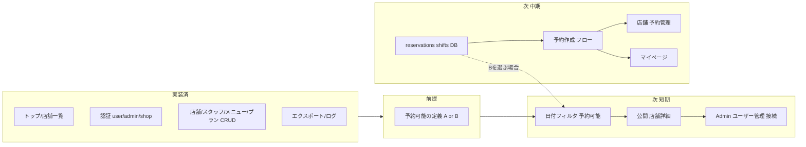

# 実装状況と次に実装すべき内容

## 1. 現在の実装状況

### 1.1 公開サイト（一般・ゲスト）

| 機能         | 状態  | 備考                                                                                                                          |
| ---------- | --- | --------------------------------------------------------------------------------------------------------------------------- |
| トップページ     | 実装済 | [HomeController](../app/Http/Controllers/Public/HomeController.php) → `Public/Home.vue`                                        |
| 店舗一覧       | 実装済 | [ShopController](../app/Http/Controllers/Public/ShopController.php) → `Public/ShopList.vue`。検索（日付・都道府県・エリア）、ページネーション、プラン情報表示あり |
| 店舗詳細ページ    | 未実装 | ルートは `/shops` のみ。`/shops/{id}` 相当の公開用詳細なし                                                                                   |
| メニュー閲覧（公開） | 未実装 | 仕様上の「メニュー一覧・詳細の表示」は未実装（管理側メニューCRUDはあり）                                                                                      |
| 予約作成・管理    | 未実装 | 仕様書でも「現時点では未実装」と明記 ([03-roles-and-permissions.md](specification/03-roles-and-permissions.md) L258)                     |

**コード上の TODO**

- [FetchShopsUseCase](../app/UseCases/Public/FetchShopsUseCase.php) L18: **「予約可能な日付」で店舗を絞り込むロジックが未実装**（`$convert['date']` の when 内が空）

---

### 1.2 認証・ユーザー（一般ユーザー guard: user）

| 機能         | 状態  | 備考                       |
| ---------- | --- | ------------------------ |
| ユーザー登録     | 実装済 | `/register`、メール認証フローあり   |
| ログイン・ログアウト | 実装済 | メール/パスワード + Google OAuth |
| パスワードリセット  | 実装済 | リセットリンク・再設定画面あり          |
| メール認証      | 実装済 | 送信・確認・成功/失敗画面あり          |
| マイページ      | 未実装 | 認証後用のダッシュボード・予約履歴等のルートなし |

---

### 1.3 管理側（admin guard）

| 機能           | 状態  | 備考                                                                                                                         |
| ------------ | --- | -------------------------------------------------------------------------------------------------------------------------- |
| ログイン・ログアウト   | 実装済 | [AuthController](../app/Http/Controllers/Operator/Admin/AuthController.php)                                                   |
| ダッシュボード      | 実装済 | [AdminDashboardController](../app/Http/Controllers/Operator/Admin/AdminDashboardController.php)                               |
| 店舗 CRUD      | 実装済 | 一覧・詳細・作成・編集・削除、店舗別スタッフ/プラン画面、Excel/CSV エクスポート                                                                              |
| スタッフ CRUD    | 実装済 | 一覧・作成・編集・削除、Excel/CSV エクスポート                                                                                               |
| メニュー CRUD    | 実装済 | 一覧・作成・編集・削除、Excel/CSV エクスポート                                                                                               |
| プラン CRUD     | 実装済 | 一覧・作成・編集・削除、Excel/CSV エクスポート                                                                                               |
| エクスポートファイル管理 | 実装済 | 一覧・ダウンロード・削除、非同期エクスポート                                                                                                     |
| アクティビティログ    | 実装済 | [ActivityLogController](../app/Http/Controllers/Operator/Admin/ActivityLogController.php)                                     |
| ユーザー管理       | 未実装 | [AdminUserController](../app/Http/Controllers/Operator/AdminUserController.php) は存在するが `Inertia::render()` の引数が空で、**ルートに未登録** |

---

### 1.4 店舗側（shop guard）

| 機能                   | 状態  | 備考                                                                           |
| -------------------- | --- | ---------------------------------------------------------------------------- |
| ログイン・ログアウト           | 実装済 | [Shop\AuthController](../app/Http/Controllers/Operator/Shop/AuthController.php) |
| ダッシュボード              | 実装済 | ShopDashboardController                                                      |
| 自店舗プロフィール・スタッフ・プラン閲覧 | 実装済 | ProfileController（profile, staffs, plans）                                    |
| スタッフ CRUD            | 実装済 | 作成・編集・削除・エクスポート                                                              |
| メニュー CRUD            | 実装済 | 同上                                                                           |
| プラン CRUD             | 実装済 | 同上                                                                           |
| エクスポートファイル管理         | 実装済 | 一覧・ダウンロード・削除                                                                 |
| 予約管理（店舗側）            | 未実装 | 予約一覧・承認・却下等のルート・画面なし                                                         |
| シフト管理                | 未実装 | シフト用テーブル・ルートなし                                                               |

---

### 1.5 データベース

- **存在する主なテーブル**: users, prefectures, areas, stations, shops, shop_business_hours, shop_holidays, shop_staff, menus, plans, menu_plan, customers, export_files, uploaded_images, activity_log, permission 系, cache, jobs 等
- **存在しないテーブル**: **reservations**（予約）、シフト用テーブル。仕様上の顧客管理・ポイント・クーポン・レビュー等の専用テーブルも未作成の可能性あり（要仕様書・ER 照合）。

---

### 1.6 その他

- **config/telescope.php** L153: `TELESCOPE_COMMAND_WATCHER` を true にした際の注意書き（コマンド実行でエラーが多発する可能性）の TODO あり。
- **Git**: 変更中ファイルは `app/Exports/ExportPlan.php` のみ（M）。

---

## 2. 次に実装すべき内容（優先度の目安）

仕様書 [03-roles-and-permissions.md](specification/03-roles-and-permissions.md) では「現在実装中」として**トップページ・店舗一覧・管理監視（Telescope/Activity Log）**までをスコープとしており、**予約作成・メニュー管理（公開）などは未実装**としている。

### 2.1 「予約可能な店舗」の定義と、足りないもの（重要）

**何を持って「予約可能」とするかが決まっていないと、日付での店舗絞り込みは実装できない。**

参考にしている **ozmoll（OZmall）** については、仕様書 [06-database-design.md](specification/06-database-design.md) で「オズモール等の〇月限定・春のキャンペーン」として **プランの期間限定（valid_from / valid_until）** の考え方が取り入れられている。一方で、「その日に予約可能か」をどう判定するか（営業日だけ見るか、空きスロットまで見るか）は、OZmall の挙動を参考にしつつ、本システムで**仕様として決める**必要がある。

#### 定義の候補と、それぞれに必要なもの

| 「予約可能」の定義                | 必要なデータ・ロジック                                                                                            | 現状                                                                        |
| ------------------------ | ------------------------------------------------------------------------------------------------------ | ------------------------------------------------------------------------- |
| **A. その日が営業日である**        | その日が休業日（`shop_holidays`）に含まれず、かつ曜日として営業している（`shop_business_hours`）。                                    | ✅ テーブルあり。この定義なら**今のDBだけで実装可能**。                                           |
| **B. その日に空きスロットが1つ以上ある** | スタッフの出勤（**shifts**）があり、その時間帯から既存予約（**reservations**）を差し引いた「空き」が1件以上ある。プラン/メニューの所要時間に合わせたスロット計算ロジックも必要。 | ❌ **reservations テーブル未実装**、**shifts テーブル未実装**。この定義で絞り込むには、先に予約・シフトの基盤が必須。 |

つまり、**日付フィルタのTODOを解消する前に**、

1. **「予約可能」を A とするか B とするか（または段階的に A → B にするか）を決める**
2. **A なら**: 営業日判定（business_hours + shop_holidays）のユースケース/サービスを用意し、FetchShopsUseCase の `date` で絞り込む。
3. **B までやるなら**: 先に **reservations** と **shifts** のマイグレーション・モデル、および「指定日の店舗ごとに空きが1件以上あるか」を判定するロジック（スロット計算）を実装したうえで、店舗一覧の日付フィルタに組み込む。

現状は「何を持って予約可能とするか」が未定義のため、**足りないのは「仕様の決定」と、B を選ぶ場合の reservations・shifts・空き判定ロジック**となる。

---

### 2.2 公開・店舗一覧まわりの仕上げ（短期）

1. **予約可能な日付での店舗絞り込み**
   [FetchShopsUseCase](../app/UseCases/Public/FetchShopsUseCase.php) の TODO を解消する。
   - **前提**: 上記 2.1 で「予約可能」の定義（A のみ / B まで）を決める。A のみなら営業日判定のみ実装。B なら reservations・shifts 実装後に空きあり店舗の絞り込みを実装。
2. **公開用の店舗詳細ページ**
   - ルート例: `GET /shops/{shop}`
   - 店舗情報・営業時間・プラン一覧・（あれば）メニュー概要など表示。
   - 仕様「2.2 店舗情報閲覧」の「店舗詳細ページの表示」に相当。
3. **公開用のメニュー閲覧（任意だが仕様と整合）**
   - 店舗詳細または別ページで、メニュー一覧・詳細の表示。
   - 仕様「3.2 メニュー閲覧」に相当。

### 2.3 予約機能の基盤（中期）

1. **reservations テーブルとモデル**
   - [06-database-design.md](specification/06-database-design.md) の予約設計に合わせてマイグレーション・モデル・リレーション作成。
2. **予約作成フロー（一般ユーザー・ゲスト）**
   - 希望日時・メニュー/プラン選択・連絡先入力 → 予約作成・確認メール（仕様 4.1）。
3. **予約管理（店舗側）**
   - 一覧・詳細・承認・却下・編集・キャンセル（仕様 4.3）。
4. **一般ユーザー向けマイページ**
   - 予約一覧・詳細・変更・キャンセル、お気に入り店舗（仕様 7.1）。

### 2.4 管理・運用の穴埋め（短期〜中期）

1. **管理者向けユーザー管理**
   - AdminUserController の完成（一覧・検索・編集・ロール変更等）と、[routes/admin.php](../routes/admin.php) へのルート追加（`prefix('users')` 等）。
2. **シフト管理**
   - シフト用テーブル・CRUD・カレンダー表示（仕様 6.1〜6.2）。予約と連携する場合は空き時間の算出にも影響。

---

## 3. 全体の流れ（概念）

---

## 4. まとめ

- **実装済み**: 公開のトップ・店舗一覧、3 guard の認証、管理/店舗の店舗・スタッフ・メニュー・プランの CRUD、エクスポート、アクティビティログ。一般ユーザー登録・ログイン・パスワードリセット・メール認証。
- **未実装・要対応**:
  - **「予約可能」の仕様決定**（営業日のみか / 空きスロットありか）。そのうえで店舗一覧の日付フィルタ（TODO 解消）。空きスロットで絞る場合は reservations・shifts が前提。
  - 公開の店舗詳細・メニュー閲覧。
  - 予約機能全体（DB・作成・店舗側管理・マイページ）。
  - 管理者のユーザー管理（Controller の完成とルート登録）。
  - シフト管理。
